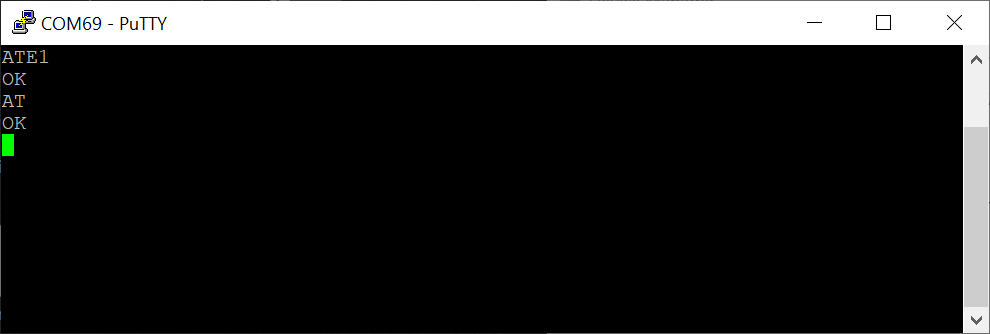
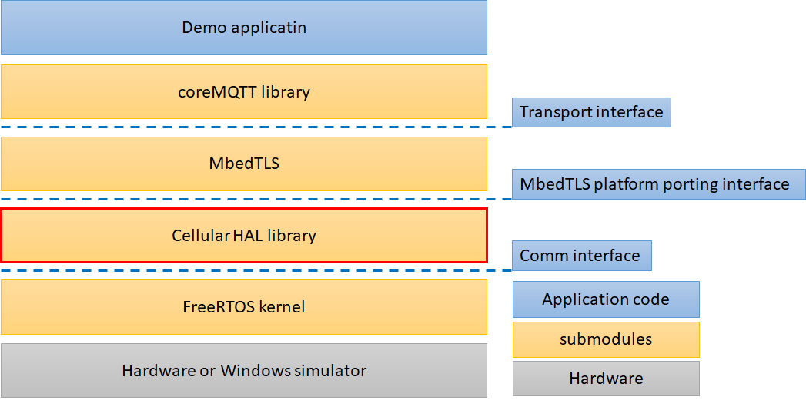
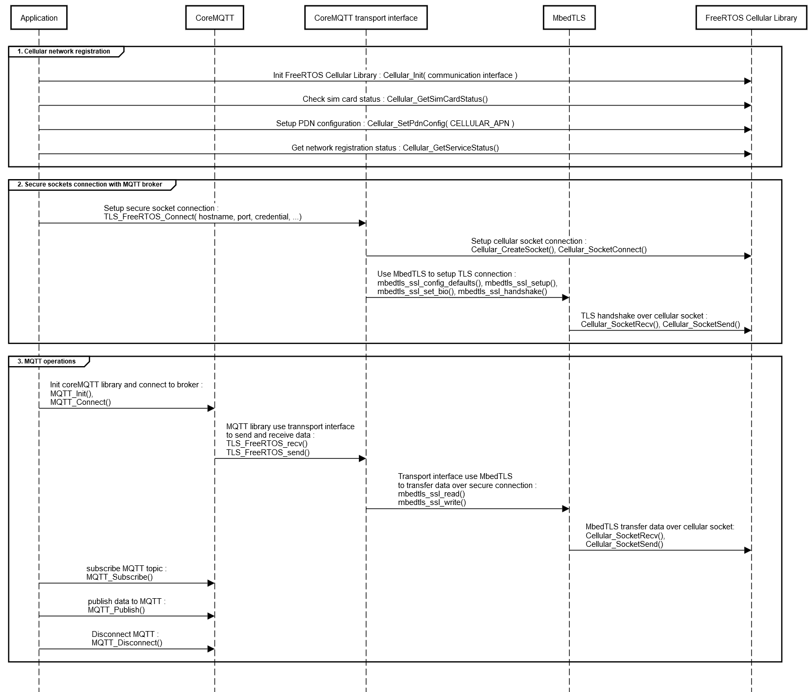

# FreeRTOS Labs - FreeRTOS Cellular Library Demo

## Introduction

FreeRTOS offers a suite of networking stacks designed for IoT applications.  Applications can access communication protocols at different levels - MQTT, HTTP, Secure Sockets, etc.  Common connectivity technologies such as Ethernet, Wi-Fi and BLE have been integrated with the networking stacks of FreeRTOS, with [a wide selection of microcontrollers and modules](https://devices.amazonaws.com/search?page=1&sv=freertos) pre-integrated.

The demos in this project demonstrate how to establish mutually authenticated MQTT connections to MQTT brokers, such as AWS IoT Core, by using cellular connectivity.  The demos use the [Cellular Library](https://github.com/FreeRTOS/Lab-Project-FreeRTOS-Cellular-Library/raw/main/doc/document/cellular.zip) sub-moduled from an external project. The FreeRTOS Cellular Library exposes the capability of a few popular cellular modems through a uniform API.

1. [Quectel BG96](https://www.quectel.com/product/lte-bg96-cat-m1-nb1-egprs/)
2. [Sierra Wireless HL7802](https://www.sierrawireless.com/products-and-solutions/embedded-solutions/products/hl7802/)
3. [U-Blox Sara-R4](https://www.u-blox.com/en/product/sara-r4-series)

The MQTT and HTTP libraries of FreeRTOS use an abstract [Transport Interface](https://github.com/FreeRTOS/coreMQTT/blob/main/source/interface/transport_interface.h) to send/receive data in a generic way.  The demos in this project offer a [implementation](https://github.com/FreeRTOS/Lab-Project-FreeRTOS-Cellular-Demo/blob/master/source/coreMQTT/using_mbedtls.c) of the Transport Interface on top of the uniform API exposed by the FreeRTOS Cellular Library.

## Hardware Setup

The demos in this project can be run in the [FreeRTOS Windows Simulator](https://freertos.org/FreeRTOS-Windows-Simulator-Emulator-for-Visual-Studio-and-Eclipse-MingW.html).  You will need a Windows PC and one of the supported cellular modems to run a demo.  A version of Visual Studio, such as the free Community version of [Visual Studios](https://visualstudio.microsoft.com/vs/community/), will be needed for building the demos.

FreeRTOS Windows simulator make use of COM port to communicate with cellular module. Setup you cellular module communication with the following steps.

1. Connect the cellular module to PC.  Most cellular dev kits have USB, in that case, just connect it to PC’s USB port and look for the COM port in Window’s Device Manager.  For example, you will see a new COM69 showing up when you connect the modem like below.  If your cellular dev kit does not have USB, use a USB adaptor [like these](https://www.amazon.com/Serial-Usb-Adapter/s?k=Serial+To+Usb+Adapter). 


<p align="center"><br>
Screenshot 1. Cellular module COM port in windows device manager</p>


2. Use [Putty](https://www.putty.org/) or any terminal tool to verify connection with the cellular module.  Refer to you cellular module’s manual for settings like baud rate, parity, and flow control.
    
    Input “ATE1”, the modem should return “OK”.  Depending on your modem setting, you may see an echo of “ATE1” as well.
    Input “AT”, the modem should return “OK”.


<p align="center"><br>
Screenshot 2. Testing the COM port with AT commands in putty</p>


## Components and Interfaces

This project makes use of five (5) sub-modules from other GitHub projects, shown as yellow boxes in the diagram below. 

<p align="center"><br>
Figure 1. Components and Interfaces</p>

The other components shown as blue boxes and dotted lines are implemented by this project:

* The [Demo Application](https://github.com/FreeRTOS/Lab-Project-FreeRTOS-Cellular-Demo/blob/main/source).  It is largely the same as the [coreMQTT demo](https://github.com/FreeRTOS/FreeRTOS/tree/master/FreeRTOS-Plus/Demo/coreMQTT_Windows_Simulator/MQTT_Mutual_Auth), with added logic to set up cellular as the transport.  (The original coreMQTT demo was designed for Wi-Fi on FreeRTOS Windows Simulator.)  There is also a demo application that integrates [1nce Zero Touch Provisioning](https://1nce.com/en/help-center/tutorials-documentations/1nce-connectivity-suite/) with the FreeRTOS Cellular Library and coreMQTT for connecting to AWS IoT Core.
* The [Transport Interface](https://github.com/FreeRTOS/Lab-Project-FreeRTOS-Cellular-Demo/blob/main/source/coreMQTT/using_mbedtls.c) is needed by the MQTT library (sub-moduled from the [coreMQTT](https://github.com/freertos/coreMQTT) project) to send and receive packets.
* The[TLS porting interface](https://github.com/FreeRTOS/Lab-Project-FreeRTOS-Cellular-Demo/blob/main/source/mbedtls/mbedtls_freertos_port.c) is needed by the mbedTLS library to run on FreeRTOS.
* The [Comm Interface](https://github.com/FreeRTOS/Lab-Project-FreeRTOS-Cellular-Demo/blob/main/source/cellular/comm_if_windows.c) is used by the FreeRTOS Cellular Library to communicate with the cellular modems over UART connections.

## Developer References and API Documents

Please refer to [FreeRTOS Cellular Library API document](https://github.com/FreeRTOS/Lab-Project-FreeRTOS-Cellular-Library/raw/main/doc/document/cellular.zip).


## Download the source code

The source code can be downloaded from the FreeRTOS labs or by itself through Github.

To clone using HTTPS:

```
git clone https://github.com/FreeRTOS/Lab-Project-FreeRTOS-Cellular-Demo.git --recurse-submodules
```

Using SSH:

```
git clone git@github.com:FreeRTOS/Lab-Project-FreeRTOS-Cellular-Demo.git --recurse-submodules
```

If you have downloaded the repo without using the `--recurse-submodules` argument, you need to run:

```
git submodule update --init --recursive
```

## Source Code Organization

The demo project files for Visual Studio are named *xyz*_mqtt_mutual_auth_demo.sln, where *xyz *is the name of the cellular modem.  They can be found on [Github](https://github.com/FreeRTOS/Lab-Project-FreeRTOS-Cellular-Demo/tree/main/projects) in the following directory:

* [projects/bg96_mqtt_mutual_auth_demo](https://github.com/FreeRTOS/Lab-Project-FreeRTOS-Cellular-Demo/tree/master/projects/bg96_mqtt_mutual_auth_demo)
* [projects/hl7802_mqtt_mutual_auth_demo](https://github.com/FreeRTOS/Lab-Project-FreeRTOS-Cellular-Demo/tree/master/projects/hl7802_mqtt_mutual_auth_demo)
* [projects/sara_r4_mqtt_mutual_auth_demo](https://github.com/FreeRTOS/Lab-Project-FreeRTOS-Cellular-Demo/tree/master/projects/sara_r4_mqtt_mutual_auth_demo)

There is also a demo for 1nce zero touch provisioning with BG96 modem:

* [projects/1nce_bg96_zero_touch_provisioning_demo](https://github.com/FreeRTOS/Lab-Project-FreeRTOS-Cellular-Demo/tree/master/projects/1nce_bg96_zero_touch_provisioning_demo)

```
./Lab-Project-FreeRTOS-Cellular-Demo
├── lib
│   ├── backoff_algorithm ( submodule : backoffAlgorithm )
│   ├── cellular ( submodule : Lab-Project-FreeRTOS-Cellular-Library )
│   ├── coreMQTT ( submodule : coreMQTT )
│   ├── FreeRTOS ( submodule : FreeRTOS-Kernel )
│   └── ThirdParty
│       └── mbedtls ( submodule : mbedtls )
├── projects
│   ├──  bg96_mqtt_mutual_auth_demo ( demo project for Quectel BG96 )
│   ├──  hl7802_mqtt_mutual_auth_demo ( demo project for Sierra Wireless HL7802 )
│   ├──  sara_r4_mqtt_mutual_auth_demo ( demo project for U-Blox Sara-R4 )
│   └──  1nce_bg96_zero_touch_provisioning_demo ( demo project for 1nce zero touch provisioning with BG96 )
└── source
    ├── cellular
    │   └── ( code for adapting FreeRTOS Cellular Library with this demo )
    ├── coreMQTT
    │   └── ( code for adapting coreMQTT with this demo )
    ├── FreeRTOS
    │   └── ( code for adapting FreeRTOS with this demo )
    ├── mbedtls
    │   └── ( code for adapting mbedtls with this demo )
    ├── main.c
    ├── cellular_setup.c
    ├── MutualAuthMQTTExample.c
    ├── demo_config.h
    ├── logging_levels.h
    ├── logging_stack.h
    ├── 1nce_zero_touch_provisioning.h
    └── 1nce_zero_touch_provisioning.c
```


## Configure Application Settings

### **Configure cellular network**

The following parameters in the cellular configuration, [cellular_config.h](https://github.com/FreeRTOS/Lab-Project-FreeRTOS-Cellular-Demo/tree/main/source/cellular), (located in "source/cellular/<cellular_module>/cellular_config.h”) must be modified for your network environment.

| Configuration   |      Description      |  Value |
|-----------------|-----------------------|--------|
| CELLULAR_COMM_INTERFACE_PORT | Cellular communication interface make use of COM port on computer to communicate with cellular module on windows simulator. | Your COM port connected to cellular module |
| CELLULAR_APN                 | Default APN for network registration. | Specify the value according to your network operator. |
| CELLULAR_PDN_CONTEXT_ID      | PDN context id for cellular network. | Default value is CELLULAR_PDN_CONTEXT_ID_MIN. |
| CELLULAR_PDN_CONNECT_TIMEOUT | PDN connect timeout for network registration. | Default value is 100000 milliseconds. |

Note

> The U-Blox SARA-R4 series support setting mobile network operators.
Set **CELLULAR_CONFIG_SARA_R4_SET_MNO_PROFILE **in [cellular_config.h](https://github.com/FreeRTOS/Lab-Project-FreeRTOS-Cellular-Demo/blob/main/source/cellular/sara_r4/cellular_config.h) according to your mobile network operator.


### **Configure MQTT broker**

The configuration for connecting to a MQTT broker can be found in “[source/demo_config.h](https://github.com/FreeRTOS/Lab-Project-FreeRTOS-Cellular-Demo/blob/main/source/demo_config.h)”. Refer to the [documentation](https://www.freertos.org/mqtt/mutual-authentication-mqtt-example.html#configuration) for more information about the settings.

### Configure COM port settings

Reference the cellular module documentation for COM port settings. Update the [comm_if_windows.c](https://github.com/FreeRTOS/Lab-Project-FreeRTOS-Cellular-Demo/blob/main/source/cellular/comm_if_windows.c) if necessary.

### **Configure other sub-modules**

[“source/FreeRTOS/FreeRTOSConfig.h](https://github.com/FreeRTOS/Lab-Project-FreeRTOS-Cellular-Demo/blob/main/source/FreeRTOS/FreeRTOSConfig.h)”, “[source/mbedtls/mbedtls_config.h](https://github.com/FreeRTOS/Lab-Project-FreeRTOS-Cellular-Demo/blob/master/source/mbedtls/mbedtls_config.h)” and “[source/coreMQTT/core_mqtt_config.h](https://github.com/FreeRTOS/Lab-Project-FreeRTOS-Cellular-Demo/blob/main/source/coreMQTT/core_mqtt_config.h)” are configurations for the corresponding sub-modules. 

## Demo Execution Step flow

The demo app performs three types of operations.  By searching the names of functions in the diagram below, you can find the exact places these operations are made in the source code.

1. Register to a cellular network. (See [cellular_setup.c](https://github.com/FreeRTOS/Lab-Project-FreeRTOS-Cellular-Demo/blob/main/source/cellular_setup.c))
2. Establish a secure connection with the MQTT broker of AWS IoT.  (See [using_mbedtls.c](https://github.com/FreeRTOS/Lab-Project-FreeRTOS-Cellular-Demo/blob/main/source/coreMQTT/using_mbedtls.c))
3. Perform MQTT operations.  (See [MutualAuthMQTTExample.c](https://github.com/FreeRTOS/Lab-Project-FreeRTOS-Cellular-Demo/blob/main/source/MutualAuthMQTTExample.c))

The following diagram illustrates the interactions between the demo app and other components.
<p align="center"><br>
Figure 2. Demo application sequence diagram</p>

## Build and run the MQTT mutual authentication demos

1. In Visual Studio, open one of the mqtt_mutual_auth_demo.sln projects that matches your cellular modem.
2. Compile and run.

The following is the console output of a successful execution of the bg96_mqtt_mutual_auth_demo.sln project. 

```
[INFO] [CELLULAR] [commTaskThread:287] Cellular commTaskThread started
>>>  Cellular SIM okay  <<<
>>>  Cellular GetServiceStatus failed 0, ps registration status 0  <<<
>>>  Cellular module registered  <<<
>>>  Cellular module registered, IP address 10.160.13.238  <<<
[INFO] [MQTTDemo] [prvConnectToServerWithBackoffRetries:583] Creating a TLS connection to a2zzppv7s4siea-ats.iot.us-west-2.amazonaws.com:8883.

[INFO] [MQTTDemo] [MQTTDemoTask:465] Creating an MQTT connection to a2zzppv7s4siea-ats.iot.us-west-2.amazonaws.com.

[INFO] [MQTTDemo] [prvCreateMQTTConnectionWithBroker:683] An MQTT connection is established with a2zzppv7s4siea-ats.iot.us-west-2.amazonaws.com.
[INFO] [MQTTDemo] [prvMQTTSubscribeWithBackoffRetries:741] Attempt to subscribe to the MQTT topic testClient13:24:47/example/topic.

[INFO] [MQTTDemo] [prvMQTTSubscribeWithBackoffRetries:748] SUBSCRIBE sent for topic testClient13:24:47/example/topic to broker.


[INFO] [MQTTDemo] [prvMQTTProcessResponse:872] Subscribed to the topic testClient13:24:47/example/topic with maximum QoS 1.

[INFO] [MQTTDemo] [MQTTDemoTask:479] Publish to the MQTT topic testClient13:24:47/example/topic.

[INFO] [MQTTDemo] [MQTTDemoTask:485] Attempt to receive publish message from broker.

[INFO] [MQTTDemo] [prvMQTTProcessResponse:853] PUBACK received for packet Id 2.

[INFO] [MQTTDemo] [MQTTDemoTask:490] Keeping Connection Idle...


[INFO] [MQTTDemo] [MQTTDemoTask:479] Publish to the MQTT topic testClient13:24:47/example/topic.

[INFO] [MQTTDemo] [MQTTDemoTask:485] Attempt to receive publish message from broker.

[INFO] [MQTTDemo] [prvMQTTProcessIncomingPublish:908] Incoming QoS : 1

[INFO] [MQTTDemo] [prvMQTTProcessIncomingPublish:919]
Incoming Publish Topic Name: testClient13:24:47/example/topic matches subscribed topic.
Incoming Publish Message : Hello World!
```

## Build and run the 1nce zero-touch-provisioning demo

1NCE is a global IoT Carrier specialized in providing managed connectivity services for low bandwidth IoT applications. In this demo, 1NCE service(a 1NCE sim card + AWS IoT device onboarding server) and BG96 cellular module are used to demonstrate how to provision device with zero-touch and connect to AWS IoT core. Refer to the [1nce blueprint for FreeRTOS](https://github.com/1NCE-GmbH/blueprint-freertos), in particular, [this flow chart](https://1nce.com/wp-content/uploads/2020/07/Identity2.png), to learn how the zero-touch-provisioning works. 

1. In Visual Studio, open the 1nce_bg96_zero_touch_provisioning_demo.sln project.  In this Visual Studio solution file, the macro of `USE_1NCE_ZERO_TOUCH_PROVISIONING` is defined. Please look for `#ifdef USE_1NCE_ZERO_TOUCH_PROVISIONING` in the source files to see how it does differently to provision the device by using the 1nce service.  Otherwise, this demo performs the same mutually authenticated MQTT operations as the other demos.
2. [Generate a self-signed certificate and its private key locally.](https://docs.aws.amazon.com/iot/latest/developerguide/create-device-cert.html) Update “[source/demo_config.h](https://github.com/FreeRTOS/Lab-Project-FreeRTOS-Cellular-Demo/blob/main/source/demo_config.h)” with the certificate and private key. These are for the purpose of establishing TLS connection to 1nce server.  Note that adding keys into a header file is done for convenience of demonstration only.  Production devices should use secure storage to store the keys.
3. Get APN for your SIM card from 1NCE.  Update `CELLULAR_APN` in file “[cellular_config.h](https://github.com/FreeRTOS/Lab-Project-FreeRTOS-Cellular-Demo/blob/main/source/cellular/bg96/cellular_config.h)” for BG96. And follow Configure Application Settings steps above to finish the rest configuration.
4. Compile and run.


